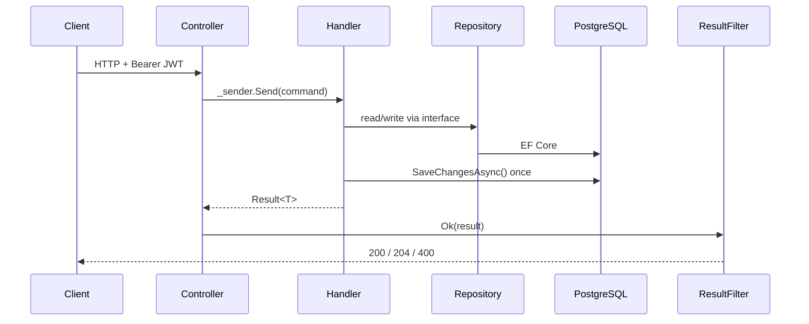

# 01 · Architecture

> Onboarding-friendly version with sequence diagrams: [`docs/confluence/02-architecture.md`](confluence/02-architecture.md).

## Backend: four projects

```
Api  ──►  Application  ◄──  Infrastructure
              │                   │
              └────►  Domain  ◄───┘
```

| Project | Responsibility | References |
|---------|----------------|------------|
| `NextAtlet.Domain` | Entities, smart-enumerations, value objects, `PermissionResolver`, `AgePolicy`. | Framework only (has a vestigial EF package ref, unused). |
| `NextAtlet.Application` | MediatR commands/queries + handlers, repository **interfaces**, `IUnitOfWork`, service interfaces, DTOs, `Result<T>`, options. **No EF.** | Domain |
| `NextAtlet.Infrastructure` | EF Core (`NextAtletDbContext`), repositories, `EfUnitOfWork`, external services (email, CVR, scraper), migrations. | Application, Domain |
| `NextAtlet.Api` | Controllers, `Program.cs`, filters, `GlobalExceptionHandler`, auth, dev seeder. | Application, Infrastructure, Domain |

## Request pattern: CQRS-lite via MediatR

- Every write is a **command**, every read a **query** — records implementing `IRequest<T>`. Handlers live beside them under `Features/**`.
- Controllers contain **no logic**; each action is `Ok(await _sender.Send(...))`.
- **MediatR 13**, wired by assembly scan (`IApplicationMarker`). **No pipeline behaviours** — no cross-cutting validation/logging/transactions. Validation is hand-rolled in each handler.
- Handlers are **orchestrators**: they use repository interfaces (never `DbContext`) and call `IUnitOfWork.SaveChangesAsync()` **once**. There is **no explicit transaction API** — atomicity is EF's implicit single-`SaveChanges` transaction.
- Identity comes from validated JWT claims, never the request body.

### Flow



## Error pipeline

`ApiError(string ErrorCode, IReadOnlyList<object> Parameters)`.

- Handlers return `Result<T>`; the global `ResultFilter` maps: success+value → **200** (bare value), success+no value → **204**, failure → **400** + `ApiError`.
- Unhandled exceptions → `GlobalExceptionHandler` → **500** `internal_error`.
- **Every business failure is 400** regardless of category; the 403/404/409/422 groupings in `ErrorCodes.cs` are comments only. **`ApiError.Parameters` is always empty.**

## Authentication (summary)

Auth0 (OIDC). Three schemes: `bearer` (JWT — the working path), `cookie` (`nextatlet.session`, vestigial — never issued), and a default `smart` policy scheme that routes on the `Authorization` header. A **global fallback policy** requires auth on every endpoint unless `[AllowAnonymous]`. Detail: [`03-accounts-and-permissions.md`](03-accounts-and-permissions.md) and [`confluence/backend/authentication-and-tokens.md`](confluence/backend/authentication-and-tokens.md).

## Frontend

Next.js 16 App Router; everything under `src/app/[locale]/` (no root `app/layout.tsx`). Middleware entry is `src/proxy.ts` (Next 16 rename), composing next-intl + Auth0. Route protection lives in the `/app` and `/onboarding` server layouts. React Query for server state; one Zustand store; Tailwind v4 tokens in `globals.css`.

## How the halves talk

Browser React Query → generated `Api` client (`src/types/api.ts`) → `customFetch` fetches a fresh token from `/auth/access-token` and adds `Authorization: Bearer …` → API at `NEXT_PUBLIC_API_URL` (origin; client adds `/api`). The token's audience (`AUTH0_AUDIENCE`) must equal the backend's `Authentication:Audience`.

## Dev startup behaviour

In Development, `Program.cs` runs `Database.EnsureDeleted()` → `Migrate()` → seed on every start — **the DB is dropped each run**. Ports: 5278 (http), 7162 (https); Swagger at `/swagger`.
