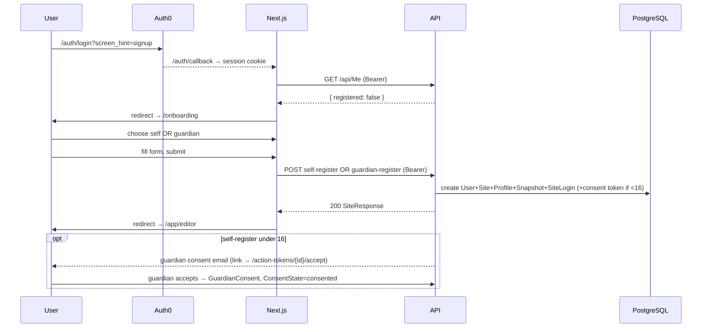

# 05 · Signup & Onboarding

The end-to-end flow across frontend and backend. Frontend detail: [`confluence/frontend/onboarding-flow.md`](confluence/frontend/onboarding-flow.md).

## The journey

## Frontend steps

1. **Decision gate** (`/app` layout): no session → Auth0; session but no profile → `/onboarding`.
2. **Profile type** (`/onboarding`): self vs guardian, carried by the route split.
3. **Self** (`/onboarding/self`): `SelfRegisterForm`. Zod schema factory (localized), Danish-aware slug auto-suggest, guardian-email field revealed when DOB < 16. `parentalConsentConfirmed` is deliberately omitted (backend records consent server-side).
4. **Guardian** (`/onboarding/guardian`): `GuardianRegisterForm`. Rejects adults client-side.
5. On success both push to `/app/editor` (the completion screen `/onboarding/complete` is currently **unreachable**).

Age thresholds mirror the backend (`derive-minor.ts`: 13/16/18) but are UI-gating only; the server re-validates.

## Backend: what gets created

- **Self-register** ([command](confluence/backend/commands/register-individual-site-self.md)): `User` (if new) + public `Site` + athlete-controlled `IndividualProfile` + default draft `SiteSnapshot` (Classic theme, hero+bio) + owner `SiteLogin`; if under 16, a consent `ActionToken` + guardian email after commit.
- **Guardian-register** ([command](confluence/backend/commands/register-individual-site-guardian.md)): same bundle but `guardian_controlled` + a guardian `SiteLogin`. **No consent token or email.**

## Guardian consent

For self-registered under-16s, the consent token's accept flow writes a `GuardianConsent` (GDPR Art. 8 audit: who/how/what/when) and sets `ConsentStateId = consented`, lifting the publish gate.

## ⚠️ Known gap

**Guardian-registered under-16s are stranded.** The shared registration base sets `ConsentStateId = pending_guardian_consent` for any child under 16 — including on the guardian path — but that path issues **no** consent token, so there's no mechanism to clear it. Fix: set `not_required` on the guardian path (the guardian is already present) or issue a self-consent token. See [guardian-register gotchas](confluence/backend/commands/register-individual-site-guardian.md#gotchas).
