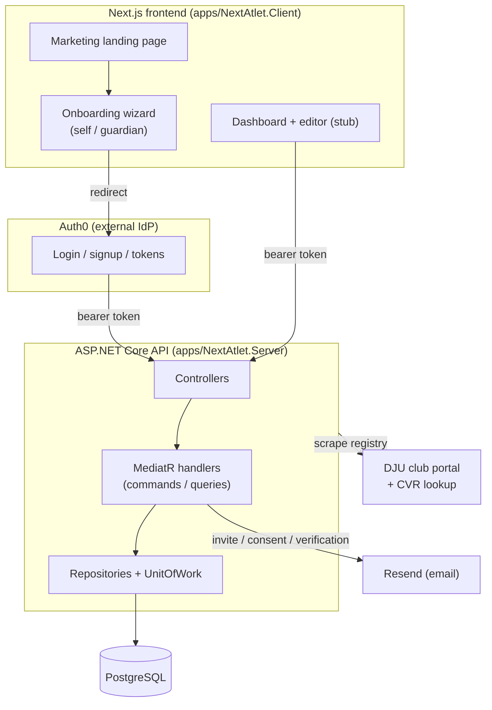

# 1. Project Overview

## The concept

**NextAtlet** lets **judo athletes in Denmark build a public profile website** — a personal page that shows who they are, their results and story, and helps them attract sponsors. The product serves three audiences:

- **Athletes** — the profile owners. They (or their guardians) create and edit a site.
- **Guardians** — parents of minors. Danish/EU law (GDPR Art. 8) requires guardian involvement for younger children, so guardianship is a first-class concept, not an afterthought.
- **Clubs / organizations** — judo clubs get their own organization pages and (in the future) can showcase their athletes.

The MVP is deliberately narrow: **judo only, Denmark only, bilingual Danish/English from day one**. The data model leaves room to generalise the sport and country later.

## The core architectural idea: config-as-data

The single most important design decision: **the backend emits no HTML.** An athlete or club site is stored as **structured content (a list of typed sections) plus a theme manifest**. The Next.js frontend reads that data and renders it with React components. This keeps rendering, caching, and theming on the frontend and keeps the backend a clean data/authorization service.

```
SiteSnapshot.Layout (JSON sections)  +  Theme.Manifest (colors, fonts, style slots)
        │
        ▼
   Next.js renders the page
```

## Tech stack

### Backend (`apps/NextAtlet.Server`)

| Concern | Choice |
|---------|--------|
| Runtime | **.NET 10** (`net10.0`) |
| API | ASP.NET Core Web API (controllers) |
| Mediation | **MediatR 13** (CQRS-lite: commands/queries + handlers) |
| ORM | **EF Core 9** with Npgsql |
| Database | **PostgreSQL** (JSONB for section/theme payloads) |
| Auth | **Auth0** (OIDC), JWT bearer + a vestigial cookie scheme |
| Email | **Resend** (falls back to a logging stub if no API key) |
| Docs/UI | Swashbuckle (Swagger) in Development |
| External data | DJU club portal scraper (Playwright + HtmlAgilityPack), Danish CVR company lookup |

### Frontend (`apps/NextAtlet.Client`)

| Concern | Choice |
|---------|--------|
| Framework | **Next.js 16** (App Router) + **React 19** |
| Auth | **@auth0/nextjs-auth0 v4** |
| Server state | **TanStack React Query** |
| Client state | **Zustand** (one store: notifications) |
| Styling | **Tailwind CSS v4** (design tokens in `globals.css`) |
| i18n | **next-intl v4** (`en` default, `da`) |
| UI primitives | Radix UI + a small custom component kit |
| Types | `src/types/api.ts` generated from the backend OpenAPI spec |

> The frontend was scaffolded from the **bulletproof-react** template. Some template leftovers (discussions/teams/users mocks, e2e tests) are still present and inert. See the [Frontend Overview](./frontend/README.md).

## Repository layout

```
nextatlet/
├── apps/
│   ├── NextAtlet.Server/          # .NET backend solution
│   │   ├── NextAtlet.Api/         # Controllers, Program.cs, filters, seeding, auth
│   │   ├── NextAtlet.Application/ # MediatR commands/queries, DTOs, interfaces (no EF)
│   │   ├── NextAtlet.Domain/      # Entities, enumerations, value objects, PermissionResolver
│   │   └── NextAtlet.Infrastructure/ # EF Core, repositories, external services, migrations
│   └── NextAtlet.Client/          # Next.js frontend
├── tests/                         # xUnit test projects (Application.Tests is the only one with source)
├── docs/                          # These docs + the legacy spec docs (00–08)
├── infra/                         # EMPTY — no infrastructure-as-code yet
├── NextAtlet.slnx                 # Solution file (new XML format)
├── CLAUDE.md                      # Context file for AI assistants
└── BACKEND_QUICK_START.md         # Backend getting-started
```

## The moving parts (conceptual map)



## Key domain concepts (glossary)

| Term | Meaning |
|------|---------|
| **Site** | The top-level publishable unit. Has a unique `Slug`, a display name, a visibility state, and a type (`individual` or `organization`). Everything user-visible hangs off a Site. |
| **IndividualProfile** | The athlete-specific data for an individual Site — sport, date of birth, control mode, consent state. (Formerly called `AthleteProfile`.) |
| **OrganizationProfile** | The club/team-specific data for an organization Site — slot count, tier, verification status. |
| **SiteSnapshot** | An immutable-ish version of a site's content: a JSONB `Layout` (list of sections) + `GlobalSettings` + a `ThemeId`. A Site points at a current *draft* snapshot and a current *published* snapshot. |
| **Theme** | The render contract: a JSONB manifest of colors, typography, and per-component/per-section style slots. |
| **SiteLogin** | Grants a `User` access to a `Site` in a role (`owner` or `guardian`). One row per (user, site). (Formerly split into `ProfileLogin` / `OrganizationLogin`, now unified.) |
| **User** | A login identity, keyed to Auth0's `sub`. Provisioned just-in-time on first authentication. Has no password — auth is delegated to Auth0. |
| **ActionToken** | A single-use, expiring token behind every emailed action link (invite, guardian consent, org email verification). The row's GUID *is* the secret. |
| **ControlMode** | Who controls a profile: `athlete_controlled`, `guardian_controlled`, or the `_shared` variants. Stored explicitly, never derived from age. |
| **ConsentState** | The GDPR publish gate: `not_required`, `pending_guardian_consent`, or `consented`. Orthogonal to visibility. |
| **Club / ClubOfficial** | A separate, scraped, read-only registry of real Danish clubs and their contact people. Used as the trusted basis for organization email verification. **Not** the same thing as `OrganizationProfile`. |

## What is built vs. not built

### Built and working

- Auth0 dual-scheme authentication + just-in-time user provisioning
- Two-path registration (self-register and guardian-register) with age gating
- The `Site` / `IndividualProfile` / `OrganizationProfile` / `SiteSnapshot` schema
- `SiteLogin` multi-login model and the `PermissionResolver` authorization model
- The `ActionToken` flow (invite / guardian consent / org email verification) with a strategy registry
- `GuardianConsent` GDPR audit records
- Control transfer + collaboration (shared editing) endpoints
- `GET /api/Me` decision gate; `GET /api/sites` public paged listing
- The scraped club registry (DJU portal + CVR lookup)
- The `Result<T>` + error-code pipeline
- Frontend: marketing landing page, the onboarding wizard, Auth0 proxy + decision gate

### Designed but NOT built

- The **public render endpoint** and the Next.js public renderer (this is the next real milestone)
- **Publish flow** + ISR/CDN cache invalidation
- The **draft-edit write path** (it was deleted during a refactor; `ISanitizationService`/`ISectionTypeRegistry` are registered but currently unused)
- **Theme picker** and theme manifest tooling beyond the one seeded "Classic" theme
- **All billing** — there is no `Plan`, `Subscription`, or `Purchase` entity, no Stripe. Tiers exist only as descriptive Domain enumerations. `PerkResolver` and `ResolveCapabilitiesCommand` are 100% commented out.
- **Media pipeline** (upload → blob → CDN) — `MediaAsset` is schema-only
- **Memberships / affiliation** — `Membership` is a schema-only entity with no commands
- **Change-request / approval workflow** — `ChangeRequest` is schema-only
- Mentoring, versioning/history, custom subdomains

See [Backend Commands](./backend/commands/README.md) for exactly what each built endpoint does, and the repo's [`docs/06-features-and-problems.md`](https://github.com/devroi5055/nextatlet/blob/main/docs/06-features-and-problems.md) for the full status board and known problems.
