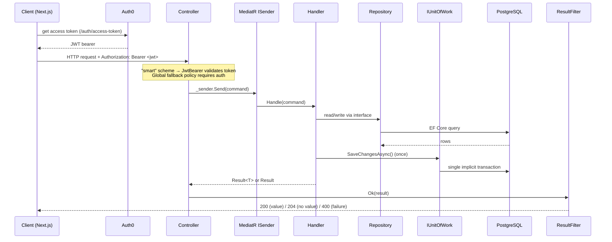
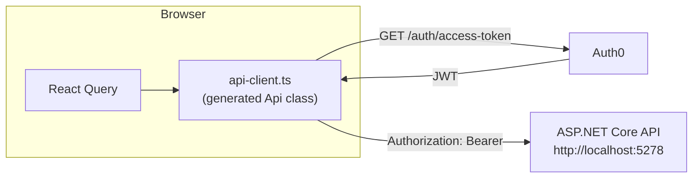

# 2. Architecture

This page explains how NextAtlet is put together: the backend's layered structure, how one HTTP request flows all the way to the database and back, how errors are shaped, and how the frontend and backend communicate.

## Backend: four projects, one dependency direction

The backend solution ([`NextAtlet.slnx`](https://github.com/devroi5055/nextatlet/blob/main/NextAtlet.slnx)) is split into four projects following a Clean Architecture layering:

```
        NextAtlet.Api  ──────────►  NextAtlet.Application  ◄──────  NextAtlet.Infrastructure
        (controllers,                 (MediatR handlers,              (EF Core, repositories,
         Program.cs,                   DTOs, interfaces)               external services,
         filters, auth)                     │                          migrations)
                                            ▼
                                     NextAtlet.Domain
                              (entities, enumerations, value objects,
                                     PermissionResolver, AgePolicy)
```

| Project | Responsibility | May reference |
|---------|----------------|---------------|
| [`NextAtlet.Domain`](https://github.com/devroi5055/nextatlet/blob/main/apps/NextAtlet.Server/NextAtlet.Domain) | Entities, smart-enumerations, value objects, the `PermissionResolver` and `AgePolicy`. Pure business types. | Nothing but the framework. This invariant fully holds. |
| [`NextAtlet.Application`](https://github.com/devroi5055/nextatlet/blob/main/apps/NextAtlet.Server/NextAtlet.Application) | The contracts and orchestration: MediatR `IRequest`/handlers, repository **interfaces**, `IUnitOfWork`, service interfaces, DTOs, the `Result<T>` type, options. **No EF here.** | Domain |
| [`NextAtlet.Infrastructure`](https://github.com/devroi5055/nextatlet/blob/main/apps/NextAtlet.Server/NextAtlet.Infrastructure) | Implements the Application interfaces over EF Core: `NextAtletDbContext`, repositories, `EfUnitOfWork`, external services (email, CVR, scraper), migrations. | Application, Domain |
| [`NextAtlet.Api`](https://github.com/devroi5055/nextatlet/blob/main/apps/NextAtlet.Server/NextAtlet.Api) | HTTP surface: controllers, `Program.cs` (DI + middleware), filters, exception handler, auth, dev seeder. | Application, Infrastructure, Domain |

> **Note:** `NextAtlet.Domain.csproj` references `Microsoft.EntityFrameworkCore` — a small layering smell (the Domain is dependency-free in spirit but has an EF package reference). It doesn't use EF; the reference is vestigial.

## The request pattern: CQRS-lite with MediatR

Every write is a **command** and every read is a **query**. Both are C# records implementing `IRequest<T>`, and each has a handler that lives right next to it under `Features/**`. Controllers contain **no logic** — every action is a one-liner that sends the request through MediatR's `ISender`:

```csharp
// A controller action, in full:
[HttpPost("self-register")]
public async Task<IActionResult> SelfRegister(RegisterIndividualSiteSelfRequest request)
    => Ok(await _sender.Send(new RegisterIndividualSiteSelfCommand(
        User.GetAuthProviderId(), User.GetEmail(),
        request.DisplayName, request.Slug, request.DateOfBirth,
        request.DefaultLocaleId, request.GuardianEmail)));
```

Key facts about this pattern as implemented:

- **MediatR 13** is wired in [`Program.cs`](https://github.com/devroi5055/nextatlet/blob/main/apps/NextAtlet.Server/NextAtlet.Api/Program.cs) by scanning the Application assembly (`IApplicationMarker`).
- **There are no MediatR pipeline behaviours.** No cross-cutting validation, logging, or transaction behaviour. Validation is hand-rolled inside each handler; mapping uses hand-written static mappers.
- **Handlers are orchestrators.** A handler never touches `DbContext`. It reads and writes through **repository interfaces** and calls `IUnitOfWork.SaveChangesAsync()` **once** at the end.
- Identity always comes from validated token claims (`User.GetAuthProviderId()` / `GetEmail()`), never from the request body.

### Request flow, end to end



## Error handling: Result + ResultFilter

The backend never returns localized error strings — it returns stable **error codes** that the frontend can translate. Two mechanisms produce the same `ApiError` shape:

```csharp
public record ApiError(string ErrorCode, IReadOnlyList<object> Parameters);
```

1. **Handlers return `Result<T>`** ([`Result.cs`](https://github.com/devroi5055/nextatlet/blob/main/apps/NextAtlet.Server/NextAtlet.Application/Common/Results/Result.cs)). A handler returns `Error.FromCode("slug.already_taken")` on failure, or the value on success. The global [`ResultFilter`](https://github.com/devroi5055/nextatlet/blob/main/apps/NextAtlet.Server/NextAtlet.Api/Filters/ResultFilter.cs) unwraps it:
   - success with a value → **200** + the bare value (envelope stripped)
   - success with no value (or `MediatR.Unit`) → **204 No Content**
   - failure → **400** + `ApiError { errorCode, parameters }`
2. **Unhandled exceptions** → [`GlobalExceptionHandler`](https://github.com/devroi5055/nextatlet/blob/main/apps/NextAtlet.Server/NextAtlet.Api/GlobalExceptionHandler.cs) → **500** + `ApiError("internal_error", [])`.

> ⚠️ **Two important realities of the current implementation:**
> - **Every business failure is HTTP 400**, regardless of whether it is semantically a not-found, conflict, or forbidden. The `ErrorCodes` catalog groups codes as 403/404/409/422 *in comments only*; the wire status is always 400. A `[ProducesResponseType(404)]` attribute on the draft-config endpoint is therefore inaccurate.
> - **`ApiError.Parameters` is always an empty list.** The "structured parameters for interpolation" half of the error contract is declared but never populated.

## Authentication (summary)

Auth is Auth0 (OIDC). Three schemes are registered, with a `smart` **policy scheme** as the default:

- `bearer` — JWT validation against the Auth0 tenant. **This is the path that actually works.**
- `cookie` — a cookie scheme (`nextatlet.session`) that is **vestigial**: nothing in the backend ever signs a user in or issues this cookie.
- `smart` — routes to `bearer` if the `Authorization` header starts with `Bearer `, else to `cookie`.

A **global fallback authorization policy** requires an authenticated user on **every** endpoint unless it carries `[AllowAnonymous]`. There are no named policies, roles, or scope checks.

Full detail — including how claims are read and how the ActionToken flow works — is on [Backend: Authentication & Tokens](./backend/authentication-and-tokens.md).

## Frontend architecture

The frontend is a **Next.js 16 App Router** application. Everything lives under `src/app/[locale]/` (there is no root `app/layout.tsx`; the locale layout is the de-facto root).

- **Routing & protection** — middleware is in [`src/proxy.ts`](https://github.com/devroi5055/nextatlet/blob/main/apps/NextAtlet.Client/src/proxy.ts) (Next 16 renamed `middleware.ts` → `proxy.ts`). It composes the next-intl middleware with the Auth0 middleware. Route protection itself lives in the `/app` and `/onboarding` **server layouts**, not in the proxy.
- **State** — React Query for anything from the API; a single Zustand store for notifications; no app-authored React contexts.
- **Styling** — Tailwind v4 with a large design-token system in [`globals.css`](https://github.com/devroi5055/nextatlet/blob/main/apps/NextAtlet.Client/src/styles/globals.css).
- **Feature-sliced** — code is organised under `src/features/<feature>/{api,components,utils}`, a bulletproof-react convention.

## How the two halves talk



- **Base URL** — `NEXT_PUBLIC_API_URL` (origin only, e.g. `http://localhost:5278`; the generated client adds the `/api` prefix).
- **Typed client** — `src/lib/api-client.ts` wraps the generated `Api` class from `src/types/api.ts`. Its `customFetch` fetches a fresh access token from `/auth/access-token` and injects `Authorization: Bearer …` on every call.
- **Token → audience contract** — the Auth0 access token's audience (`AUTH0_AUDIENCE`) must equal the backend's `Authentication:Audience` (`https://api.nextatlet.dk`). If it doesn't, the backend rejects the token.
- **Errors** — on a non-OK response the client reads `ApiError.errorCode` and raises a notification toast; React Query surfaces the thrown error to components.

For the full frontend picture, start at the [Frontend Overview](./frontend/README.md).
