# 3. Data Model & ER Diagram

This page is the authoritative picture of the NextAtlet database **as it exists in the migrations today** (source of truth: [`NextAtletDbContextModelSnapshot.cs`](https://github.com/devroi5055/nextatlet/blob/main/apps/NextAtlet.Server/NextAtlet.Infrastructure/Migrations/NextAtletDbContextModelSnapshot.cs)). There are **15 `DbSet`s mapping to 14 tables** (`OrgVerification` is an owned type folded into `OrganizationProfiles`).

## The one-paragraph mental model

A **Site** is the top-level publishable unit. It is *specialised* by exactly one of two profile rows — **IndividualProfile** (an athlete) or **OrganizationProfile** (a club) — which link back via a `SiteId` column. Content is versioned as **SiteSnapshot** rows (JSONB layout + a theme); the Site points at a current draft and a current published snapshot. Access is granted by **SiteLogin** rows (User × Site × role). Emailed link flows (invite, guardian consent, org verification) all funnel through one **ActionToken** table. **Club / ClubOfficial** is a separate scraped registry used to verify organizations. **Membership**, **ChangeRequest**, and **MediaAsset** exist in the schema but have no application logic yet.

## ER diagram

```mermaid
erDiagram
    Users ||--o{ SiteLogins : "has"
    Sites ||--o{ SiteLogins : "grants access to"
    Sites ||--o{ ActionTokens : "targets"
    Sites ||--o{ GuardianConsents : "for"
    Users ||--o{ GuardianConsents : "consented by (Restrict)"
    Sites ||--o{ MediaAssets : "owns (optional)"
    Sites |o--o| SiteSnapshots : "current draft (Restrict)"
    Sites |o--o| SiteSnapshots : "current published (Restrict)"
    Themes ||--o{ SiteSnapshots : "renders (Restrict)"
    Themes ||--o{ ChangeRequests : "proposes (Restrict)"
    IndividualProfiles ||--o{ Memberships : "affiliates"
    OrganizationProfiles ||--o{ Memberships : "rosters"
    IndividualProfiles ||--o{ ChangeRequests : "targets"
    OrganizationProfiles ||--o{ ChangeRequests : "proposed by"
    Users ||--o{ ChangeRequests : "proposed by (Restrict)"
    Clubs ||--o{ ClubOfficials : "has"

    Sites {
        uuid Id PK
        string Slug UK "unique, max 256"
        string DisplayName
        string SiteTypeId "individual | organization"
        string VisibilityStateId "public | private"
        string VerificationStatusId
        string DefaultLocaleId "da | en"
        uuid CurrentDraftSnapshotId FK "nullable"
        uuid CurrentPublishedSnapshotId FK "nullable"
    }
    IndividualProfiles {
        uuid Id PK
        uuid SiteId "NO FK, NO index"
        string SportId "default judo"
        date DateOfBirth
        string ControlModeId
        string ConsentStateId
        string SelfTierId "nullable, never written"
    }
    OrganizationProfiles {
        uuid Id PK
        uuid SiteId "NO FK, NO index"
        string OrganizationTypeId
        string OrganizationTierId "default free"
        int AthleteSlotCount
        bool IsServerManaged
        string VerificationStatusId
        json Verification "owned OrgVerification"
    }
    SiteSnapshots {
        uuid Id PK
        uuid SiteId "indexed, NO FK"
        uuid ThemeId FK
        jsonb Layout
        jsonb GlobalSettings "nullable"
        datetime PublishedUtc "nullable"
    }
    Themes {
        uuid Id PK
        string Name
        jsonb Manifest
        string PreviewImageUrl "nullable"
        datetime RetiredUtc "nullable"
    }
    Users {
        uuid Id PK
        string Email UK "unique"
        string AuthProviderId UK "unique, nullable (Auth0 sub)"
    }
    SiteLogins {
        uuid Id PK
        uuid UserId FK
        uuid SiteId FK
        string SiteRoleId "owner | guardian"
        string StatusId "pending | active | revoked"
        jsonb Permissions "nullable, always null (dead)"
    }
    ActionTokens {
        uuid Id PK "= the link secret"
        string TypeId "invitation | consent | org_email_verification"
        uuid TargetSiteId FK
        datetime ExpiresUtc
        datetime AcceptedUtc "null = pending"
        jsonb Payload "polymorphic"
    }
    GuardianConsents {
        uuid Id PK
        uuid SiteId FK
        uuid GuardianUserId FK "Restrict"
        string MethodId "email"
        string TermsVersion
    }
    MediaAssets {
        uuid Id PK
        uuid AthleteSiteId FK "nullable → Sites"
        uuid OrganizationId "nullable, NO FK"
        string TypeId "image | video"
        string OriginId
        bool IsClubBranding
        string StorageKey
    }
    Memberships {
        uuid Id PK
        uuid IndividualProfileId FK
        uuid OrganizationId FK
        string RoleId
        string statusId "active | inactive"
        bool OccupiesSlot
    }
    ChangeRequests {
        uuid Id PK
        uuid TargetProfileId FK
        uuid ProposingOrganizationId FK
        uuid ProposedByUserId FK "Restrict"
        uuid ThemeId FK
        jsonb ProposedLayout
        bool IsActive "no StatusId column"
    }
    Clubs {
        uuid Id PK
        string Source "UK with SourceKey"
        string SourceKey
        string CountryId
        string Name
        string Address "nullable"
        stringarray SportIds
        bool IsActive
    }
    ClubOfficials {
        uuid Id PK
        uuid ClubId FK
        string Name
        string Email "nullable"
        string Phone "nullable"
        string RoleId
    }
```

## Relationships (with delete behaviour)

Format: `Parent 1..* Child via FK (OnDelete)`.

| # | Relationship | FK column | OnDelete |
|---|--------------|-----------|----------|
| 1 | Users → SiteLogins | `UserId` | Cascade |
| 2 | Sites → SiteLogins | `SiteId` | Cascade |
| 3 | Sites → ActionTokens | `TargetSiteId` | Cascade |
| 4 | Sites → GuardianConsents | `SiteId` | Cascade |
| 5 | Users → GuardianConsents | `GuardianUserId` | **Restrict** |
| 6 | Sites → MediaAssets | `AthleteSiteId` (nullable) | Cascade |
| 7 | Sites → SiteSnapshots (current draft) | `Sites.CurrentDraftSnapshotId` | **Restrict** |
| 8 | Sites → SiteSnapshots (current published) | `Sites.CurrentPublishedSnapshotId` | **Restrict** |
| 9 | Themes → SiteSnapshots | `ThemeId` | **Restrict** |
| 10 | Themes → ChangeRequests | `ThemeId` | **Restrict** |
| 11 | IndividualProfiles → ChangeRequests | `TargetProfileId` | Cascade |
| 12 | OrganizationProfiles → ChangeRequests | `ProposingOrganizationId` | Cascade |
| 13 | Users → ChangeRequests | `ProposedByUserId` | **Restrict** |
| 14 | IndividualProfiles → Memberships | `IndividualProfileId` | Cascade |
| 15 | OrganizationProfiles → Memberships | `OrganizationId` | Cascade |
| 16 | Clubs → ClubOfficials | `ClubId` | Cascade |
| 17 | OrganizationProfiles ◇ OrgVerification | owned type, same table | — |

## ⚠️ Relationships that are NOT enforced (bare uuid columns, no FK)

This is a critical thing to understand before writing queries or trusting referential integrity:

| Column | Should point to | Reality |
|--------|-----------------|---------|
| `IndividualProfiles.SiteId` | `Sites.Id` | **No FK, no index.** The central Site↔profile link is unenforced and unindexed — `GetBySiteIdAsync` is a sequential scan. |
| `OrganizationProfiles.SiteId` | `Sites.Id` | **No FK, no index.** |
| `SiteSnapshots.SiteId` | `Sites.Id` | Indexed, but **no FK** (likely deliberate — a real FK plus the two draft/published pointers would create a cascade cycle). |
| `MediaAssets.OrganizationId` | `OrganizationProfiles.Id` | **No FK, no index.** |
| `OrganizationProfiles.Verification_VerifiedByUserId` | `Users.Id` | **No FK.** |
| Every `*Id` enumeration column | — | **No FK/CHECK.** Enumeration ids are validated only in C#, never by the database. |

There are **no CHECK constraints anywhere** in the model. The `MediaAsset` "owner is XOR of athlete-site or organization" rule is documented in a code comment but **not enforced** in the DB.

## Indexes

| Table | Index | Unique? |
|-------|-------|---------|
| Users | `Email` | Yes |
| Users | `AuthProviderId` | Yes (nullable — Postgres allows many NULLs) |
| Sites | `Slug` | Yes (one global namespace for individuals + orgs) |
| Sites | `CurrentDraftSnapshotId`, `CurrentPublishedSnapshotId` | No |
| SiteLogins | `(UserId, SiteId)` | Yes (one login per user per site) |
| SiteLogins | `UserId`, `SiteId` | No (`UserId` is redundant with the unique index) |
| ActionTokens | `(TypeId, AcceptedUtc)`, `TargetSiteId` | No |
| GuardianConsents | `SiteId` (not unique), `GuardianUserId` | No |
| IndividualProfiles | `SportId`, `CreatedUtc` (DESC) | No |
| OrganizationProfiles | `OrganizationTypeId` | No |
| SiteSnapshots | `SiteId`, `ThemeId`, `CreatedUtc` (DESC) | No |
| MediaAssets | `AthleteSiteId` | No |
| Memberships | `IndividualProfileId`, `OrganizationId` | No |
| ChangeRequests | `TargetProfileId`, `ProposingOrganizationId`, `ProposedByUserId`, `ThemeId` | No |
| Clubs | `(Source, SourceKey)` | Yes (the scrape identity) |
| ClubOfficials | `ClubId` | No |

There are **no filtered/partial indexes**. `Themes.Name` is **not** indexed despite a lookup-by-name query.

## How JSONB value objects are stored

Several columns are `jsonb` but EF sees them as **opaque `string`s** via the converter in [`JsonbValueConversion.cs`](https://github.com/devroi5055/nextatlet/blob/main/apps/NextAtlet.Server/NextAtlet.Infrastructure/Persistence/JsonbValueConversion.cs). Consequences:

- You **cannot** query inside them with LINQ (e.g. `Where(x => x.Payload.Email == …)`). Code that needs to filter by JSON contents materialises rows and filters in memory.
- Serialization uses `JsonSerializerDefaults.Web` → **camelCase** property names.

| Value object | Stored on | Column |
|--------------|-----------|--------|
| `SiteLayout` (list of `SiteSection` → polymorphic `SectionData`: `hero`, `bio`) | `SiteSnapshot.Layout`, `ChangeRequest.ProposedLayout` | jsonb, required |
| `GlobalSettings` (`AccentColor`, `FontFamily`) | `SiteSnapshot.GlobalSettings` | jsonb, nullable |
| `ThemeManifest` (colors, typography, component/section style slots) | `Theme.Manifest` | jsonb, required |
| `ActionTokenPayload` (polymorphic: invite / consent / orgEmailVerification) | `ActionToken.Payload` | jsonb, required |
| `LoginPermissions` | `SiteLogin.Permissions` | jsonb, nullable — **always null (dead model)** |
| `OrgVerification` | `OrganizationProfile.Verification` | **not jsonb** — EF owned type, flattened into `Verification_*` columns |
| `LocalizedText` (`{ da, en }`) | nested inside the above graphs | never its own column |

## Smart-enumeration pattern

Enumerations (e.g. `ControlModes`, `Sport`, `ConsentStates`) are **not** C# `enum`s — they use a smart-enumeration base class ([`Enumeration.cs`](https://github.com/devroi5055/nextatlet/blob/main/apps/NextAtlet.Server/NextAtlet.Domain/Common/Enumeration.cs)) with a string `Id` and a bilingual `LocalizedText` `Title`/`Description`. Entities store the raw **string `Id`** in a `varchar` column. There is **no lookup table and no FK/CHECK** — a bad string is only caught if `FromId()` is called (which throws), and most read paths never call it.

> Note: `Enumeration.Equals` compares only `Id`, with no type check — so `AthleteTier.Free == OrganizationTier.Free` evaluates to `true`. Keep that in mind if you ever compare enumerations across types.

## Seed data

Exactly **one** `HasData` seed exists in the persistence layer: the **"Classic" theme** ([`ThemeConfiguration.cs`](https://github.com/devroi5055/nextatlet/blob/main/apps/NextAtlet.Server/NextAtlet.Infrastructure/Persistence/Configurations/Sites/ThemeConfiguration.cs)) with the fixed id `11111111-1111-1111-1111-111111111111`. **Every registration depends on this theme existing** — if migrations haven't run, registration throws "Classic theme not found". Runtime dev data (athletes, clubs, tokens) is seeded separately by [`DevelopmentDataSeeder`](https://github.com/devroi5055/nextatlet/blob/main/apps/NextAtlet.Server/NextAtlet.Api/Seeding/DevelopmentDataSeeder.cs) — see [Running the Application](./04-running-the-application.md).

## Entity reference (quick)

| Entity | Table | Base | Purpose |
|--------|-------|------|---------|
| `Site` | Sites | AuditableEntity | The publishable web presence |
| `IndividualProfile` | IndividualProfiles | AuditableEntity | Athlete data for an individual Site |
| `OrganizationProfile` | OrganizationProfiles | AuditableEntity | Club data for an org Site |
| `SiteSnapshot` | SiteSnapshots | CreatedOnlyEntity | A versioned content layout + theme |
| `Theme` | Themes | CreatedOnlyEntity, IRetirable | Render manifest (colors/fonts/slots) |
| `SiteLogin` | SiteLogins | AuditableEntity | User × Site × role access grant |
| `User` | Users | AuditableEntity | Login identity (Auth0 `sub`) |
| `ActionToken` | ActionTokens | AuditableEntity | Single-use emailed action link |
| `GuardianConsent` | GuardianConsents | CreatedOnlyEntity | GDPR Art. 8 audit record |
| `MediaAsset` | MediaAssets | CreatedOnlyEntity | Blob/CDN reference (schema-only) |
| `Membership` | Memberships | AuditableEntity | Athlete↔org affiliation (schema-only) |
| `ChangeRequest` | ChangeRequests | AuditableEntity | Club-proposed layout change (schema-only) |
| `Club` | Clubs | AuditableEntity | Scraped club registry row |
| `ClubOfficial` | ClubOfficials | AuditableEntity | Scraped club contact person |

For the exhaustive column-by-column breakdown, see the repo's [`docs/02-data-model.md`](https://github.com/devroi5055/nextatlet/blob/main/docs/02-data-model.md).
