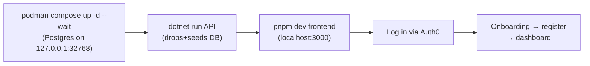

# 4. Running the Application

This guide gets both halves of NextAtlet — the .NET backend and the Next.js frontend — running on your machine.

## Prerequisites

| Tool | Version | Needed for |
|------|---------|-----------|
| **.NET SDK** | **10.0** | All backend projects target `net10.0` |
| **Podman** | 5+ (plus a compose provider — see below) | Runs the dev PostgreSQL container |
| **Node.js** | 20+ (with **pnpm 9+**; `corepack enable` provides it) | The frontend |
| **Google Chrome** | any | *Only* if you call the club scraper (`POST /api/clubs/scrape`), which uses Playwright with `Channel = "chrome"` |
| **Auth0 tenant** | — | Anything that requires login (everything except `/api/clubs/*`) |

## Backend

### 1. Start the dev database (Podman)

The dev database is a Postgres 16 container run by **Podman**, defined in [`compose.yaml`](https://github.com/devroi5055/nextatlet/blob/main/compose.yaml) at the repo root:

```bash
podman machine init && podman machine start   # one-time, if you don't have a Podman machine yet
podman compose up -d --wait                   # from the repo root — returns once Postgres is healthy
podman compose down                           # stop it (add -v to also delete the data volume)
```

The container publishes Postgres on **`127.0.0.1:32768`** only (not reachable from your network). Every dev connection string — [`appsettings.json`](https://github.com/devroi5055/nextatlet/blob/main/apps/NextAtlet.Server/NextAtlet.Api/appsettings.json), `appsettings.Development.json`, the `Program.cs` fallback and the EF design-time factory — points at it:

```
Host=localhost;Port=32768;Database=nextatlet;Username=postgres;Password=postgres
```

> `podman compose` delegates to a compose provider. Install either `docker-compose` (`winget install Docker.DockerCompose` — Apache-2.0, does **not** require Docker Desktop) or `podman-compose` (`pip install podman-compose`).

### 2. (Optional) Set secrets via user-secrets

Two settings are read from configuration but are **not** in any appsettings file, so they default to empty:

- `Resend:InviteApiKey` — the Resend email API key. **If empty, the backend uses a logging stub** ([`LoggingEmailService`](https://github.com/devroi5055/nextatlet/blob/main/apps/NextAtlet.Server/NextAtlet.Infrastructure/Services/LoggingEmailService.cs)) that just logs the action link instead of emailing — which is fine for local dev.
- `CvrApi:AccessToken` — bearer token for the Danish CVR company API (only used by the unused CVR lookup service).

To set them:

```bash
cd apps/NextAtlet.Server/NextAtlet.Api
dotnet user-secrets set "Resend:InviteApiKey" "<your-key>"
dotnet user-secrets set "CvrApi:AccessToken" "<your-token>"
```

### 3. Build and run

```bash
# from the repo root
dotnet restore NextAtlet.slnx
dotnet build   NextAtlet.slnx

# run the API (Development profile — see the warning below)
dotnet run --project apps/NextAtlet.Server/NextAtlet.Api            # profile "http"  → http://localhost:5278
dotnet run --project apps/NextAtlet.Server/NextAtlet.Api -lp https  # profile "https" → https://localhost:7162
```

- Swagger UI is available in Development at **http://localhost:5278/swagger**.
- Ports: **5278** (http), **7162** (https).

> ### ⚠️ Development startup DROPS the database every run
> In Development, [`Program.cs`](https://github.com/devroi5055/nextatlet/blob/main/apps/NextAtlet.Server/NextAtlet.Api/Program.cs) calls **`Database.EnsureDeleted()` then `Database.Migrate()`** on every startup, then re-seeds. **Every `dotnet run` wipes the entire database** and recreates it from scratch. Do not put anything you want to keep in the dev database. Running `dotnet ef database update` manually is pointless while in Development because the next run drops it anyway.

### 4. What the dev seeder creates

[`DevelopmentDataSeeder`](https://github.com/devroi5055/nextatlet/blob/main/apps/NextAtlet.Server/NextAtlet.Api/Seeding/DevelopmentDataSeeder.cs) is idempotent (it no-ops if any `Site` already exists) and creates:

- 3 adult athletes: `ada-jensen`, `bjorn-madsen`, `david-sorensen`
- 2 minor athletes: `clara-holm`, `emma-lund`, each with a live guardian-consent `ActionToken`
- 1 guardian invitation token on the first minor
- 5 organizations (2 clubs, an academy, a training centre, a national team), all `Pending` verification
- 1 registry `Club` + a chairman `ClubOfficial`, plus one live org-email-verification token

Auth subjects are `seed|{slug}`; emails are `{slug}@seed.nextatlet.dk`.

### 5. EF migrations

The design-time factory is [`NextAtletDbContextFactory`](https://github.com/devroi5055/nextatlet/blob/main/apps/NextAtlet.Server/NextAtlet.Infrastructure/Persistence/NextAtletDbContextFactory.cs) (it hardcodes `localhost:32768`, the Podman dev DB — `dotnet ef database update` uses this, not `appsettings.json`).

```bash
dotnet ef migrations add <Name> \
  --project apps/NextAtlet.Server/NextAtlet.Infrastructure \
  --startup-project apps/NextAtlet.Server/NextAtlet.Api

dotnet ef database update \
  --project apps/NextAtlet.Server/NextAtlet.Infrastructure \
  --startup-project apps/NextAtlet.Server/NextAtlet.Api
```

### 6. Tests

```bash
dotnet test NextAtlet.slnx
```

> Only `tests/NextAtlet.Application.Tests` contains actual test source (~113 facts). `NextAtlet.Api.Tests`, `NextAtlet.Domain.Tests`, and `NextAtlet.Infrastructure.Tests` are empty project shells. `coverlet.runsettings` exists for coverage but no script wires it up.

## Frontend

### 1. Environment

There is **no `.env.example`** in the repo (only a `.env.example-e2e` for Playwright). Create `apps/NextAtlet.Client/.env` with:

```dotenv
# Backend origin (no /api suffix — the generated client adds it)
NEXT_PUBLIC_API_URL=http://localhost:5278

# Auth0 (from your Auth0 tenant)
AUTH0_DOMAIN=your-tenant.eu.auth0.com
AUTH0_CLIENT_ID=your-regular-web-app-client-id
AUTH0_CLIENT_SECRET=your-client-secret
AUTH0_SECRET=a-long-random-string-for-cookie-encryption
APP_BASE_URL=http://localhost:3000

# MUST equal the backend's Authentication:Audience
AUTH0_AUDIENCE=https://api.nextatlet.dk
```

> **Why `AUTH0_AUDIENCE` matters:** if it's missing, Auth0 returns an encrypted userinfo token the backend can't validate; if it points at a non-existent API, `/authorize` fails outright. It must match an Auth0 API Identifier **and** the backend's `Authentication:Audience`. See [Frontend: Configuration](./frontend/configuration.md).

### 2. Install and run

```bash
cd apps/NextAtlet.Client
corepack enable     # makes pnpm available from the packageManager field (one-time)
pnpm install

pnpm dev            # http://localhost:3000 (redirects / → /en)
pnpm build
pnpm start
pnpm check-types    # tsc --noEmit
pnpm test           # vitest
pnpm storybook      # http://localhost:6006
```

> The frontend uses **pnpm** (`pnpm-lock.yaml` + a `packageManager` field). `corepack enable` pins the exact pnpm version automatically — you don't need a global install.

> ### Known broken frontend scripts
> - `pnpm lint` — **fails**: `next lint` was removed in Next.js 16.
> - `pnpm gen:api` — **would break the API client**: the codegen pipeline is misconfigured (wrong tool, missing output dir, wrong DLL path). Do not run it without fixing it first. See [Frontend: Configuration](./frontend/configuration.md#known-issues).
> - Several Playwright e2e tests and some unit tests reference bulletproof-react template code that no longer exists and will fail.

## Typical local dev loop



## Deployment note

`infra/` is an **empty directory** — there is no infrastructure-as-code. There is a [`Dockerfile`](https://github.com/devroi5055/nextatlet/blob/main/apps/NextAtlet.Server/Dockerfile) for the API (targets Railway, build context must be `apps/NextAtlet.Server`; build it locally with `podman build apps/NextAtlet.Server`). CI ([`.github/workflows/dotnet.yml`](https://github.com/devroi5055/nextatlet/blob/main/.github/workflows/dotnet.yml)) is the stock template and **currently cannot pass** — it installs the .NET 8 SDK against `net10.0` projects.
