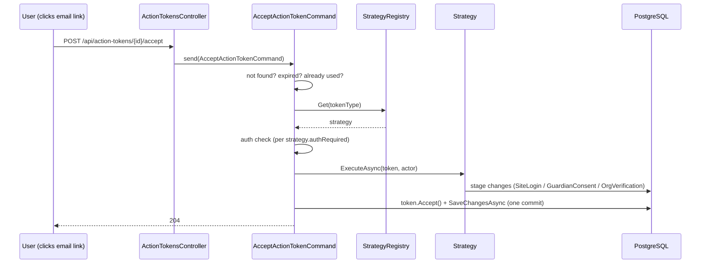

# Backend: Authentication & Tokens

This page explains how the backend authenticates requests and how the single-use **ActionToken** flow (invites, guardian consent, org verification) works.

## Authentication schemes

Auth is **Auth0 (OIDC)**. Three schemes are registered in [`Program.cs`](https://github.com/devroi5055/nextatlet/blob/main/apps/NextAtlet.Server/NextAtlet.Api/Program.cs), with a `smart` **policy scheme** as the default:

| Scheme | Handler | Role |
|--------|---------|------|
| `bearer` | JwtBearer | Validates a JWT against the Auth0 tenant. **The only path that actually works.** |
| `cookie` | Cookie (`nextatlet.session`) | **Vestigial** — nothing in the backend ever signs a user in or issues this cookie. In practice it only ever produces a 401. |
| `smart` | Policy scheme (default) | Forwards to `bearer` if the `Authorization` header starts with `Bearer `, else to `cookie`. |

Configuration (from `appsettings.Development.json`):

- **Authority:** `https://nextatlet-dev.eu.auth0.com/` (trailing slash required — used for OIDC discovery)
- **Audience:** `https://api.nextatlet.dk` (the JWT's `aud` must match this)
- The token's `sub` maps to `ClaimTypes.NameIdentifier`.

### Global authorization policy

There are **no named policies, roles, or scope checks.** A single **fallback policy** requires an authenticated user on **every** endpoint. To make an endpoint public you must add `[AllowAnonymous]` (as `ClubsController` does).

## Reading claims

[`ClaimsPrincipalExtensions`](https://github.com/devroi5055/nextatlet/blob/main/apps/NextAtlet.Server/NextAtlet.Api/ClaimsPrincipalExtensions.cs) extracts identity:

| Method | Behaviour |
|--------|-----------|
| `GetAuthProviderId()` | Reads `sub` (or `NameIdentifier`); **throws** if missing → surfaces as a **500**, not a 401 |
| `GetEmail()` | Reads the configured namespaced email claim (`https://nextatlet.dk/email`), with fallbacks; **throws** if missing → 500 |
| `TryGetAuthProviderId()` | Returns `null` instead of throwing (used by the action-token accept endpoint) |

> ⚠️ Missing claims produce a **500 `internal_error`**, not a clean 401. The error codes `auth.sub_missing` / `auth.email_missing` are only used as exception messages, never as responses.

## Just-in-time user provisioning

There is no "create account" step. The first time someone **registers a site**, [`UserProvisioner`](https://github.com/devroi5055/nextatlet/blob/main/apps/NextAtlet.Server/NextAtlet.Application/Features/Identity/UserProvisioner.cs) get-or-creates a `User` row, keyed **by Auth0 `sub` only** (never by email). It does *not* call `SaveChangesAsync` — the calling handler owns the commit. `GET /api/Me` deliberately does **not** provision, so an invited person can see a pending invite before any `User` row exists.

## Action tokens

An **ActionToken** ([`ActionToken.cs`](https://github.com/devroi5055/nextatlet/blob/main/apps/NextAtlet.Server/NextAtlet.Domain/Entities/Identity/ActionToken.cs)) is a single-use, expiring row behind every emailed action link. **The row's GUID is the secret** — there is no separate token column; the id goes straight into the link.

| Field | Meaning |
|-------|---------|
| `Id` | The link key / secret |
| `TypeId` | `invitation` / `consent` / `org_email_verification` |
| `TargetSiteId` | The site the action applies to |
| `ExpiresUtc` | Expiry |
| `AcceptedUtc` | Null = pending; set = consumed (single use) |
| `Payload` | Polymorphic JSONB: `InvitePayload` / `ConsentPayload` / `OrgEmailVerificationPayload` |

### The three flows

| Flow | Issued by | Payload | On accept |
|------|-----------|---------|-----------|
| **Invitation** | [`InviteToProfileCommand`](./commands/invite-to-profile.md) | `{ Email, RoleId }` | Creates an active `SiteLogin` |
| **Guardian consent** | [`RegisterIndividualSiteSelfCommand`](./commands/register-individual-site-self.md) (for under-16s) | `{ Email, TermsVersion }` | Writes a `GuardianConsent`, sets `ConsentStateId = consented` |
| **Org email verification** | [`SendOfficialEmailVerificationCommand`](./commands/send-official-email-verification.md) | `{ ClubOfficialId, UserId, Email }` | Sets the org's `VerificationStatusId = verified` |

### Accept flow

Full mechanics: [Accept Action Token](./commands/accept-action-token.md) and [Action Token Strategies](./commands/action-token-strategies.md).

## ⚠️ Known auth gaps (must fix before production)

- **`SendOfficialEmailVerificationCommand` has no ownership check** and returns the token id in the body → any authenticated user can verify an arbitrary organization. See its [page](./commands/send-official-email-verification.md#gotchas).
- **No accept-time email match** in the invitation/consent strategies — the link-holder gets the role regardless of who they are.
- **`GetDraftAthleteSiteSnapshotQuery` has no authorization** — any authenticated user reads any draft.
- **`ClubsController` is fully `[AllowAnonymous]`**, including two mutating `PUT`s and the scrape trigger.
- Missing claims yield 500 rather than 401.

## Related

- [Backend: Configuration](./configuration.md) · [Architecture](../02-architecture.md) · [Frontend: Authentication](../frontend/authentication.md)
