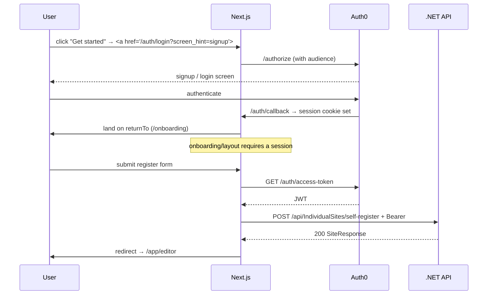

# Frontend: Authentication

The frontend uses **@auth0/nextjs-auth0 v4**. This page covers the proxy/middleware composition, the Auth0 client, how login/logout links work, how access tokens are obtained and attached to API calls, and where route protection lives.

## The middleware is `src/proxy.ts`

Next.js 16 renamed the middleware entry point from `middleware.ts` to **[`proxy.ts`](https://github.com/devroi5055/nextatlet/blob/main/apps/NextAtlet.Client/src/proxy.ts)**. Its composition order matters:

1. If the path starts with `/auth` → hand the whole request to `auth0.middleware(request)` (Auth0 owns those routes, unlocalized).
2. Otherwise: run the **next-intl** middleware first, then run `auth0.middleware`, and copy every `Set-Cookie` header from the Auth0 response onto the intl response — so the session cookie keeps rolling on localized pages.

**Route protection is NOT here.** It lives in the `/app` and `/onboarding` server layouts. See [Routing & Layouts](./routing-and-layouts.md#the-decision-gate-applayouttsx).

## The Auth0 client (`src/lib/auth0.ts`)

```ts
const audience = process.env.AUTH0_AUDIENCE;
export const auth0 = new Auth0Client(
  audience
    ? { authorizationParameters: { audience, scope: process.env.AUTH0_SCOPE ?? 'openid profile email offline_access' } }
    : undefined,
);
```

**Why `AUTH0_AUDIENCE` is load-bearing:**

- If it's **unset**, Auth0 returns an *encrypted* userinfo token (JWE) and the .NET backend fails to validate it (`IDX10609 Decryption failed`).
- If it points at a **non-existent** Auth0 API, `/authorize` rejects the request ("service not found") and login breaks.
- It **must equal** the backend's `Authentication:Audience` (`https://api.nextatlet.dk`).

## Mounted `/auth/*` routes

`auth0.middleware` mounts the SDK defaults: `/auth/login`, `/auth/logout`, `/auth/callback`, `/auth/profile`, `/auth/access-token`, plus MFA/passwordless/passkey endpoints. The access-token endpoint is enabled by default, which is what makes the browser token flow below work.

## Login / signup / logout links

- **Login:** `<a href="/auth/login?returnTo=…">`
- **Signup:** `<a href="/auth/login?screen_hint=signup&returnTo=%2Fonboarding">` — the SDK forwards `screen_hint=signup` to Auth0, landing on the signup screen. There's no separate `/auth/register` route.
- **Logout:** `router.push('/auth/logout')`

> All `/auth/*` links are **plain `<a>` tags, not `next/link`** — deliberately. These are proxy routes, not Next pages, so they need a full browser navigation (an RSC fetch would fail). This is consistent and commented throughout the code.

## Getting and attaching an access token

### Browser (`src/lib/api-client.ts`)

```ts
const res = await fetch('/auth/access-token', { credentials: 'include' });
const { token } = await res.json();
// → injected as `Authorization: Bearer ${token}` in the generated client's customFetch
```

> ⚠️ A fresh `/auth/access-token` round-trip happens on **every single API call** — no caching or memoisation.

### Server (`src/features/onboarding/api/check-profile-server.ts`)

```ts
const { token } = await auth0.getAccessToken();
const res = await fetch(`${env.API_URL}/api/Me`, {
  headers: { Authorization: `Bearer ${token}` }, cache: 'no-store',
});
```

A hand-rolled `fetch` (not the generated client) so `next/headers` never leaks into the client bundle.

## Full login-to-dashboard flow



## Known issues

- **Token round-trip per request** — `/auth/access-token` is called before every API call, uncached.
- **`AuthLayout` login/register title** never switches (path compare bug — see Routing page).
- The dashboard welcome uses `user.firstName`/`lastName`, which don't exist on the Auth0 v4 user shape (should be `given_name`/`family_name`) — so it renders blank.
- React Query Devtools never appear (`process.env.DEV` is a Vite var, not a Next one).
- `src/lib/authorization.ts` is entirely commented out; `src/features/auth/components/login-form.tsx` too.

## Related

- [Backend: Authentication & Tokens](../backend/authentication-and-tokens.md) · [Configuration](./configuration.md) · [Routing & Layouts](./routing-and-layouts.md)
