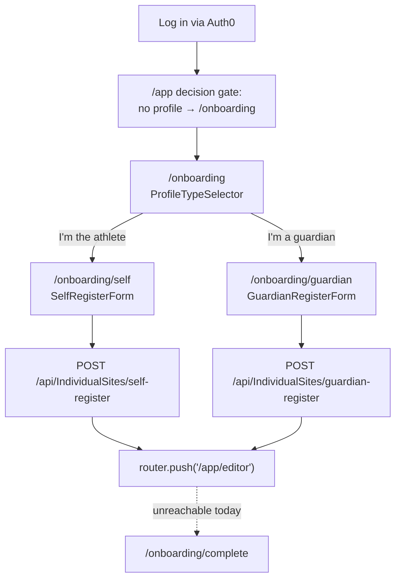

# Frontend: Onboarding Flow

The onboarding wizard is the **only fully-working authenticated flow** in the frontend today. It walks a newly-logged-in user through registering either their own athlete profile or a child's. Source: [`src/features/onboarding`](https://github.com/devroi5055/nextatlet/blob/main/apps/NextAtlet.Client/src/features/onboarding).

## The journey



> The auth gate in `onboarding/layout.tsx` requires a session first — if there's none, it redirects to `/auth/login?returnTo=%2Fonboarding`. This is why the register endpoints can read identity from the token instead of the body.

## Step 1 — profile type selector (`/onboarding`)

A server component with two cards driven by an `options` array: **self** → `/onboarding/self`, **guardian** → `/onboarding/guardian`. The branch is carried by the **route split**, not by state.

## Step 2a — self registration (`/onboarding/self`)

`SelfRegisterForm` (client). The Zod schema is built by a **factory** (`makeSelfRegisterInputSchema(t)`) so validation messages are localized:

| Field | Rule |
|-------|------|
| `displayName` | 1–80 chars |
| `slug` | 3–60 chars, `^[a-z0-9]+(?:-[a-z0-9]+)*$` |
| `dateOfBirth` | ISO `yyyy-mm-dd` from `<input type="date">` |
| `defaultLocaleId` | `da` or `en` (**defaults to `da`** regardless of UI locale) |
| `guardianEmail` | email, **required when the DOB implies age < 16** |

Extra `superRefine` rules: reject if below the self-register floor (age < 13); require a guardian email if age < 16.

UX details:
- `displayName`'s `onBlur` auto-suggests a slug (only if the slug field is empty), via a Danish-aware `slugify` (`æ→ae`, `ø→oe`, `å→aa`, then diacritic strip).
- The guardian-email field is **conditionally revealed** the moment the DOB implies age < 16.
- **`parentalConsentConfirmed` is deliberately omitted** from the payload — the backend ignores it, and legally-binding consent (email + terms version + timestamp) is recorded server-side via the guardian consent-token flow.

On success: `POST /api/IndividualSites/self-register`, invalidate the `['me']` query, then `router.push('/app/editor')`.

## Step 2b — guardian registration (`/onboarding/guardian`)

`GuardianRegisterForm` (client). Fields: `childDisplayName`, `slug`, `childDateOfBirth`, `defaultLocaleId`. The `superRefine` **inverts** the age rule: if the child is 18+, error `adultMustSelfRegister` — a guardian can't register an adult.

On success: `POST /api/IndividualSites/guardian-register`, invalidate `['me']`, `router.push('/app/editor')`.

## Age thresholds (mirror the backend)

[`src/features/onboarding/utils/derive-minor.ts`](https://github.com/devroi5055/nextatlet/blob/main/apps/NextAtlet.Client/src/features/onboarding/utils/derive-minor.ts) mirrors the backend's `AgeThresholdOptions`, explicitly for **UI gating only** (the server re-validates):

```ts
AGE_THRESHOLDS = { absoluteMinimum: 13, selfConsent: 16, guardianBoundary: 18 }
```

with helpers `getAge`, `requiresGuardianConsent` (age < 16), `isBelowSelfRegisterFloor` (age < 13), `isAdult` (age ≥ 18).

## Step 3 — completion (unreachable)

`/onboarding/complete?state=ready|consent-pending|guardian` is fully built and translated, **but neither form navigates to it** — both push straight to `/app/editor`. The `consent-pending` state (which would tell a self-registered minor that a guardian email was sent) is therefore currently never shown to the user.

## Known issues

- **`/onboarding/complete` is dead** — see above. The only place the user would be told a consent email was sent.
- **`defaultLocaleId` defaults to `'da'`** in both forms regardless of the active UI locale, so an English user silently creates a Danish site unless they change the dropdown.
- There's an **orphaned duplicate** self-register implementation at `src/features/individual-sites/api/self-register.ts` (weaker schema, stale `['user']` query key) — imported by nothing. Don't edit that one.

## Related

- [Backend: Register Individual Site (Self)](../backend/commands/register-individual-site-self.md) · [Backend: Register Individual Site (Guardian)](../backend/commands/register-individual-site-guardian.md) · [Get Current User](../backend/commands/get-current-user.md)
