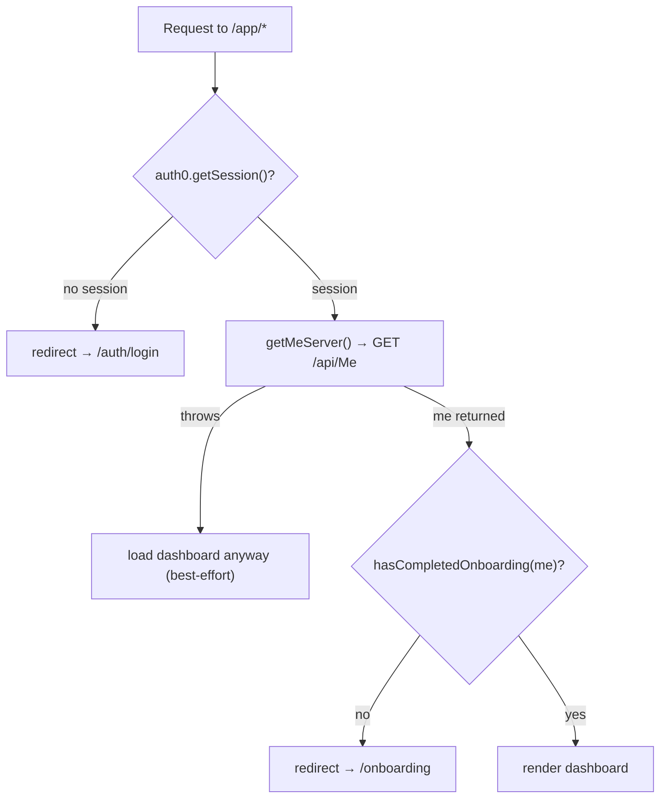

# Frontend: Routing & Layouts

Every route lives under [`src/app/[locale]/`](https://github.com/devroi5055/nextatlet/blob/main/apps/NextAtlet.Client/src/app/%5Blocale%5D). There is **no root `src/app/layout.tsx`** — the locale layout is the de-facto root and renders `<html>`/`<body>`.

## Routes

| Path | File | Server/Client | What it does |
|------|------|---------------|--------------|
| `/[locale]` (root layout) | `[locale]/layout.tsx` | Server | Validates the locale, sets up `NextIntlClientProvider` → `AppProvider`, renders `<html>`/`<body>`. `dynamic = 'force-dynamic'`. |
| — | `[locale]/provider.tsx` | Client | `AppProvider`: error boundary → `Auth0Provider` → `QueryClientProvider` → global `<Notifications/>` |
| `/[locale]` | `(marketing)/page.tsx` | Server | The landing page (`<LandingPage/>`) |
| `(marketing)` layout | `(marketing)/layout.tsx` | Server | Marketing header + footer |
| `/[locale]/login` | `(auth)/login/page.tsx` | Client | A single link to `/auth/login`. **Dead — nothing links here.** |
| `/[locale]/register` | `(auth)/register/page.tsx` | Client | A link to `/auth/login?screen_hint=signup`. **Dead.** |
| `(auth)` layout | `(auth)/layout.tsx` | Server | Card shell for auth pages |
| `/[locale]/onboarding` | `onboarding/page.tsx` | Server | Profile-type selector (self vs guardian) |
| `/[locale]/onboarding/self` | `onboarding/self/page.tsx` | Server | Self-registration form |
| `/[locale]/onboarding/guardian` | `onboarding/guardian/page.tsx` | Server | Guardian-registration form |
| `/[locale]/onboarding/complete` | `onboarding/complete/page.tsx` | Server | Completion screen. **Currently unreachable** (forms push straight to the editor). |
| `onboarding` layout | `onboarding/layout.tsx` | Server | **Auth gate** — redirects to `/auth/login` if there's no session; wizard card shell |
| `/[locale]/app` | `app/page.tsx` | Server | Dashboard welcome |
| `/[locale]/app/editor` | `app/editor/page.tsx` | Server | **Stub** — placeholder cards, "coming soon" |
| `app` layout | `app/layout.tsx` | Server | **The three-way decision gate** (see below) |
| `/[locale]` (404) | `[locale]/not-found.tsx` | Server | 404 page |

Route groups: `(auth)` and `(marketing)`. `app/` and `onboarding/` are plain segments.

## Layout hierarchy

```
[locale]/layout.tsx  (root: html/body, providers)
├── (marketing)/layout.tsx  → landing
├── (auth)/layout.tsx       → login/register (dead)
├── onboarding/layout.tsx   → auth gate + wizard shell
│     ├── /onboarding, /self, /guardian, /complete
└── app/layout.tsx          → decision gate + dashboard shell
      ├── /app, /app/editor
```

## The decision gate (`app/layout.tsx`)

The single most important piece of routing logic. On every `/app/*` request the server layout does:



- **`hasCompletedOnboarding(me)`** = `Boolean(me.profileId) || (me.guardedProfileIds?.length ?? 0) > 0`. The guardian branch matters — a guardian has no own `profileId` but does have guarded sites.
- The profile check is **best-effort**: if `GET /api/Me` throws, the dashboard still loads (so a broken token integration doesn't trap users). `redirect()` is deliberately called *outside* the `try` because it signals by throwing.

## Params handling (inconsistent)

Different pages read params differently: the root layout does `await params`, the marketing page uses React's `use(params)`, and `onboarding/complete` does `await searchParams`. There's no `generateStaticParams` for `[locale]`, and `force-dynamic` on the root layout makes the `setRequestLocale` calls (which exist for static rendering) moot.

## Known issues

- `/login` and `/register` pages exist but **nothing links to them** — every CTA goes straight to the Auth0 SDK route `/auth/login`.
- `/onboarding/complete` is fully built and translated but **unreachable** — both registration forms redirect to `/app/editor` on success.
- The dashboard sidebar links to `/app/discussions`, `/app/users`, `/app/profile` — **none of these routes exist** (bulletproof-react leftovers).
- `AuthLayout`'s "is this the login page?" check compares against `/auth/login` but the real pathname is `/en/login`, so the heading is always the register title.

## Related

- [Authentication](./authentication.md) · [Onboarding Flow](./onboarding-flow.md)
